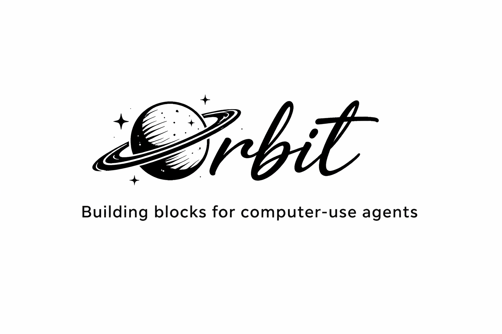

<p>

</p>


<video src="./orbit_demo.mp4" controls playsinline width="100%">
  <a href="./orbit_demo.mp4">Download demo video</a>
</video>


Orbit is a composable toolkit for building Computer Use Agents (CUAs) focused on providing structure and control. It provides both a standalone multi-step agent and a composable SDK.

Most CUA frameworks either automate the complete task as a black box or expose raw tools with no structure. Orbit sits in between , natural language controls the screen, Python controls the flow. Each primitive (`Do`, `Read`, `Check`, `Navigate`, `Fill`) is an independent agent with its own budget, model, and typed output, but they share context within a session. This means you can use a lightweight model for simple clicks and a heavier model for complex tasks, control max LLM calls per step, and extract structured data from the screen into Pydantic models. Also, if you realise the agent is struggling at a particular step, you can pass in some extra guidance through the `extra_info` kwarg, this lets you control the stepwise information flow. We also let you use `planner=False` for lower-latency direct execution on simple steps, or keep the default `planner=True` for decomposing on complex tasks to multiple simpler tasks. Orbit uses the OS accessibility tree instead of screenshots or DOM parsing, which means a bit less token usage and direct access to UI elements across both desktop apps and browsers.

## Composable SDK

For more controlled workflows, use verbs with a shared session in a pythonic way:

```python
from orbit import Do, Read, Check, Navigate, Fill, session
from pydantic import BaseModel
import asyncio
from dotenv import load_dotenv

load_dotenv()

class Product(BaseModel):
    name: str
    price: float
    in_stock: bool

class ProductList(BaseModel):
    products: list[Product]

async def main():
    # Use lighter model(s) or stronger model(s).
    action_model = "gemini-3-flash-preview"

    async with session() as s:
        await Navigate(
            "https://www.amazon.com/s?k=mechanical+keyboard",
            session=s,
            llm=action_model,
            max_steps=30,
            planner=False,
            extra_info="Avoid bookmark bar links; use direct navigation tools first.",
            verbose=True,
        ).run()

        if await Check(
            "The current page is a Captcha page and `Continue Shopping` button is visible",
            session=s,
            llm=action_model,
            max_steps=30,
            verbose=True,
            planner=False,
        ).check():
            await Do(
                "First click on the `Continue Shopping` button, then solve the Captcha using the Screenshot tool.",
                session=s,
                llm=action_model,
                max_steps=30,
                verbose=True,
                planner=False,
            ).run()

        products = await Read(
            "All the search results",
            schema=ProductList,
            session=s,
            llm=action_model,
            max_steps=30,
            verbose=True,
        ).run()

        if products.status != "success" or products.output is None:
            raise RuntimeError(f"Read failed: status={products.status} summary={products.summary!r}")

        cheapest = min(products.output.products, key=lambda p: p.price)
        await Do(
            f"click on '{cheapest.name}'",
            session=s,
            llm=action_model,
            max_steps=30,
            verbose=True,
        ).run()

        if await Check(
            "Add to Cart button is visible",
            session=s,
            llm=action_model,
            max_steps=30,
            planner=False,
            verbose=True,
        ).check():
            await Do(
                "click Add to Cart",
                session=s,
                llm=action_model,
                max_steps=30,
                verbose=True,
            ).run()

asyncio.run(main())
```

## Standalone Agent

For one-shot tasks, just describe what you want:

```python
from orbit import Agent
import asyncio

async def main():
    result = await Agent(
        task="Open Chrome and navigate to Wikipedia",
        llm="gemini-3-pro-preview",
        planner=False,  
        verbose=True,
    ).run()
    print(result.status, result.summary)

asyncio.run(main())
```

## Implementing Custom Verb 

You can create reusable domain-specific actions by subclassing `BaseActionAgent` and 
defining both the task prompt and output schema.

```python
from orbit import BaseActionAgent, Navigate, session
from pydantic import BaseModel
import asyncio


class Product(BaseModel):
    name: str
    price: float
    in_stock: bool


class ProductList(BaseModel):
    products: list[Product]


class ReadTopProducts(BaseActionAgent):
    def __init__(self, category: str, **kw):
        super().__init__(max_steps=12, planner=False, **kw)
        self.category = category

    def task_prompt(self) -> str:
        return (
            f"OBSERVE: Read top products for category '{self.category}' from the current page.\n"
            "Extract product name, price, and stock status only. "
            "Do not click or navigate."
        )

    def output_schema(self):
        return ProductList


async def main():
    async with session() as s:
        await Navigate("https://www.amazon.com/s?k=mechanical+keyboard", session=s).run()

        result = await ReadTopProducts(
            category="mechanical keyboard",
            session=s,
            llm="gemini-3-flash-preview",
            verbose=True,
            planner=False,
            extra_info="Only include visible, on-page product cards.",
        ).run()

        print(result.status)
        if result.output:
            print(result.output.products[:3])

asyncio.run(main())
```

## Installation

Install from PyPI:

```bash
pip install orbit-cua
```

Install from Source:

```bash
git clone --recurse-submodules https://github.com/aadya940/orbit.git
cd orbit

# Build the OculOS daemon (requires Rust)
cd oculos && cargo build --release && cd ..
mkdir -p orbit/_bin
# Windows:
copy oculos\target\release\oculos.exe orbit\_bin\oculos.exe
# Linux/macOS:
# cp oculos/target/release/oculos orbit/_bin/oculos

pip install .
```

macOS users might need to grant additional permissions for UI Interaction as defined [here](https://github.com/huseyinstif/oculos?tab=readme-ov-file#macos-grant-accessibility-permission).

Set your API key for whichever provider you use. Orbit supports any model via [LiteLLM](https://docs.litellm.ai/):

```bash
# Gemini
export GEMINI_API_KEY="your-key"

# OpenAI
export OPENAI_API_KEY="your-key"

# Anthropic
export ANTHROPIC_API_KEY="your-key"
```


## Safety

Orbit never permanently deletes files , destructive operations go to Trash/Recycle Bin. Disk writes require human approval via a configurable callback.

## License

Apache License 2.0

### Special Thanks to 

[OculOS](https://github.com/huseyinstif/oculos)
and other open-source packages used ...
